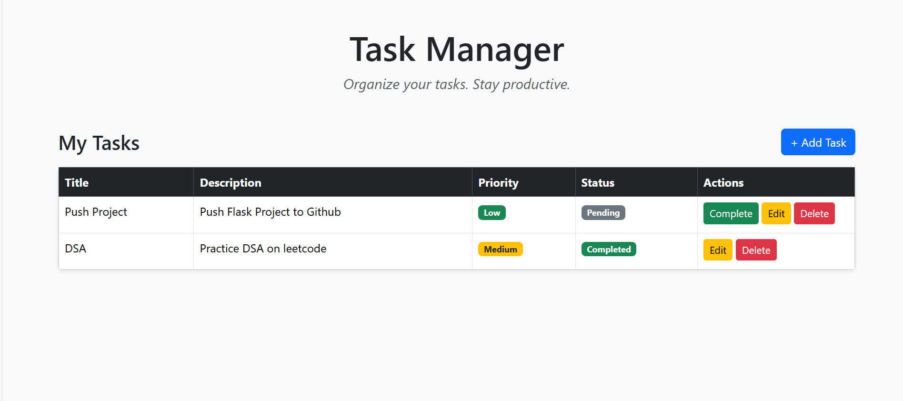
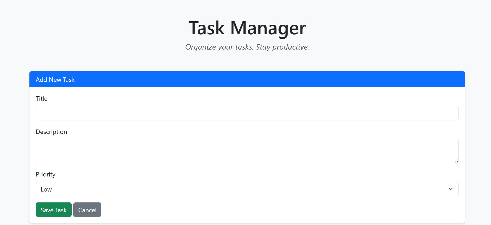

#Task Manager Application (Laravel)

A simple and clean Task Manager web application built using Laravel that allows users to create, view, update, and manage tasks efficiently.
This project follows proper MVC architecture, uses Laravel form validation, resource routing, and is deployed with a cloud MySQL database.
It is also deployed online using Railway.

#Live Demo
Deployed Application:https://task-manager-laravel-production-8405.up.railway.app/

#Features
Add new tasks
Set task priority (Low / Medium / High)
Track task status (Pending / Completed)
Mark tasks as completed
Persistent task storage using MySQL
Clean and user-friendly interface

#Task Behavior
Every new task is created with Pending status by default
Tasks can later be marked as Completed
Priority levels include Low, Medium, and High
All task data is stored in a database

#Tech Stack
Backend: Laravel (PHP)
Frontend: Blade Templates, HTML, CSS
Database: MySQL
Local: XAMPP
Production: Railway MySQL
Deployment: Railway
Version Control: Git & GitHub

#Architecture
This project follows the MVC (Model-View-Controller) pattern:
Model: Task – Handles database operations
View: Blade templates – Handles UI
Controller: TaskController – Handles business logic

#Project Structure (Important Files)
app/
 └── Http/Controllers/TaskController.php
app/
 └── Models/Task.php
database/
 └── migrations/
resources/
 └── views/tasks/index.blade.php
routes/
 └── web.php

#Technical Expectations Covered
*Proper MVC usage
*Laravel form validation
*Resource routing
*Clean, readable, and maintainable code

#Local Setup Instructions
1️⃣ Clone the repository
git clone https://github.com/Prapthigatty/task-manager-laravel.git
cd task-manager-laravel

2️⃣ Install dependencies
composer install

3️⃣ Create environment file
cp .env.example .env

4️⃣ Generate application key
php artisan key:generate

5️⃣ Configure database in .env
DB_CONNECTION=mysql
DB_HOST=127.0.0.1
DB_PORT=3306
DB_DATABASE=task_manager
DB_USERNAME=root
DB_PASSWORD=

6️⃣ Run migrations
php artisan migrate

7️⃣ Start the server
php artisan serve

Visit  http://127.0.0.1:8000

#Deployment Details
The application is deployed using Railway
Uses Railway-hosted MySQL database

# Screenshots

### Home Page

### Add Task Page

Author
Prapthi A